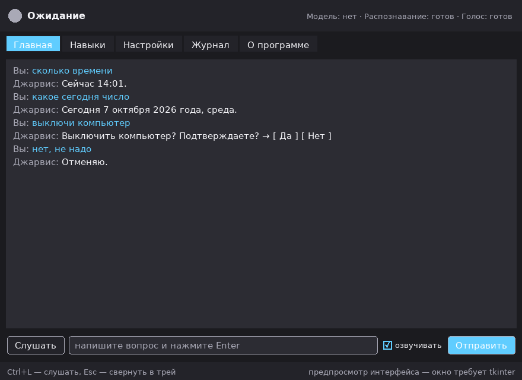
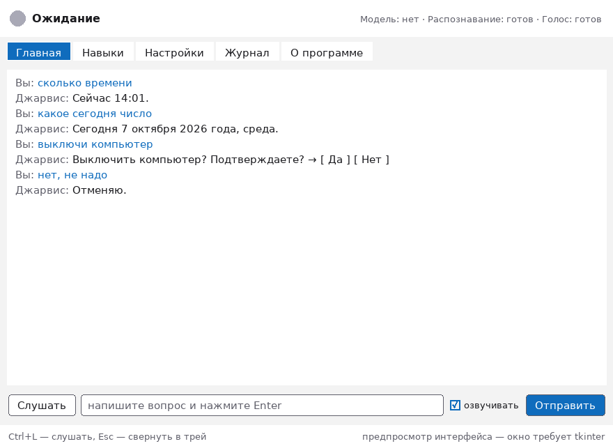

# Этап 2 — окно Jarvis

Отчёт для проверки. Код — в ветке `arena/2cac497d-jarvis`, коммит «Этап 2».

## Что появилось

* **Локальный API** — тонкая дверь между ядром и любым интерфейсом. Слушает
  только `127.0.0.1`, порт выбирает сам и записывает в `{state}/api.json`,
  токен лежит в файле с правами `600`. Окно, трей, демон и терминал говорят с
  ядром одинаково, поэтому интерфейс можно заменить (или написать второй), не
  трогая навыки.
* **Окно на Tkinter** — пять вкладок, русские подписи, светлая и тёмная темы.
* **Трей** — закрытие окна сворачивает его, а не выключает ассистента; значок
  умеет «Слушать», «Показать окно» и «Выход». Библиотек `pystray`/`Pillow` может
  не быть — тогда окно прямо пишет «Трей недоступен» и работает без значка.
* **Горячая клавиша и слово-активатор** — будят ассистента; при вызове из фона
  окно показывает состояние, а хоткей в демоне остался прежним.
* **Микрофон в окне** — кнопка «Слушать» рядом с полем ввода и кнопка «Стоп»,
  если распознавание затянулось.

## Как окно выглядит

Тёмная тема:



Светлая тема:



## Вкладки

| Вкладка | Что внутри |
| --- | --- |
| Главная | история диалога, поле ввода (Enter — отправить), кнопка «Слушать», индикатор «Ожидание / Слушаю / Думаю / Отвечаю / Ошибка», галочка «озвучивать», кнопка «Стоп» |
| Навыки | список навыков: включён/выключен, описание, примеры фраз, права; переключатель сохраняется сразу |
| Настройки | модель и провайдеры, голос, горячая клавиша, язык, тема. Поля ключей скрыты звёздочками; введённое значение уходит **только** в `.env`, а в конфиге остаётся `${ИМЯ}`. Кнопка «Сохранить» пишет лишь изменённые поля и говорит, сколько сохранила |
| Журнал | последние события и кнопка «Скопировать для отчёта» — из текста вырезаются значения секретов, чтобы его можно было кому-то отправить |
| О программе | версия, адрес ядра, пути к настройкам, данным и журналу, лицензии сторонних проектов (Piper, whisper.cpp, openWakeWord, pystray, Pillow) |

Подсказки внизу окна: `Ctrl+L` — слушать, `Esc` — свернуть в трей.

## Безопасность

* секреты — только `.env` (права `600`), в конфиге ссылки `${ИМЯ}`;
* ключи не печатаются в консоль, журнал и окно; в интерфейсе они замаскированы;
* ввод ключа в окне пишется в `.env`, не в `config.toml`;
* опасные действия (выключение, перезагрузка, удаление файлов) спрашивают
  подтверждение прямо в чате; вкладка «Журнал» при копировании маскирует
  секреты;
* распознанный голос по-прежнему только выбирает заранее записанную команду.

## Лёгкость (замеры в песочнице, 4 ГБ RAM)

| Что | Память |
| --- | --- |
| импорт модуля окна **без** Tkinter | 16.7 МБ |
| ядро + локальный API + 5 запросов (без окна) | 26.8 МБ |
| простой демон без голоса | 18.8 МБ, 1 поток |

Tkinter входит в стандартный Python, сторонних фреймворков в окне нет; значок
в трее единственная необязательная зависимость (просится только при
`--no-tray` её отключении). Фоновые опросы ядра ограничены четырьмя
одновременными, а API отвечает `Connection: close` — 450 запросов подряд не
добавили ни одного дескриптора.

## Тесты

```
python3 -m pytest tests -q      →  226 passed, 116 subtests, 4 прогона подряд
```

24 из них — «окно»: подставной Tkinter прогоняет настоящие ядро и API, а тесты
проходят по сценариям: вопрос-ответ и история, голосовая кнопка, подтверждение и
отказ от опасного действия, список навыков и переключатель, сохранение настроек
(в том числе когда ничего не менялось), ввод ключа → только `.env`, копирование
журнала с маскированием, переходы по вкладкам, отсутствие трея, закрытие окна в
трей, горячая клавиша и внешний триггер.

## Что проверить у себя

```bash
python3 -m jarvis status        # окружение
python3 -m jarvis ask "сколько времени" --no-speak
python3 -m jarvis gui           # окно (нужен Tkinter)
python3 -m pytest -q
```

Если окно не открылось и написано «Не найден модуль tkinter» — доустановите его:
Arch/CachyOS `sudo pacman -S tk`, Debian/Ubuntu `sudo apt install python3-tk`,
Windows — переустановите Python с галочкой «tcl/tk and IDLE». Остальные команды
работают и без него.

Проверить стоит: тёмную и светлую тему, сохранение настроек (меняется только
изменённое), ввод ключа и его отсутствие в `config.toml` и в журнале, выключение
по «выключи компьютер» с подтверждением, сворачивание в трей, вызов по хоткею.

## Ограничения, о которых надо знать

* В песочнице разработки Tkinter отсутствует, поэтому картинки выше — макет,
  нарисованный тем же кодом (`tools/gui_preview.py`). Настоящее окно снять
  негде: пути, зависящие от реального Tk (геометрия, шрифты, полосы прокрутки),
  покрыты только чтением кода. Первый запуск на вашей машине и есть проверка.
* `jarvis doctor`, установка и удаление одной командой, `docs/DEVELOPERS.md` и
  README для обычных пользователей — это Этап 3.
