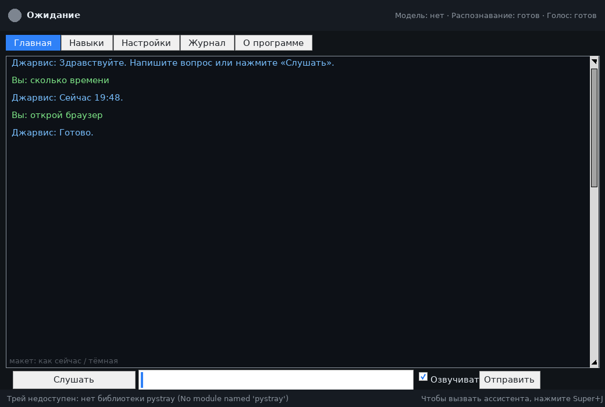
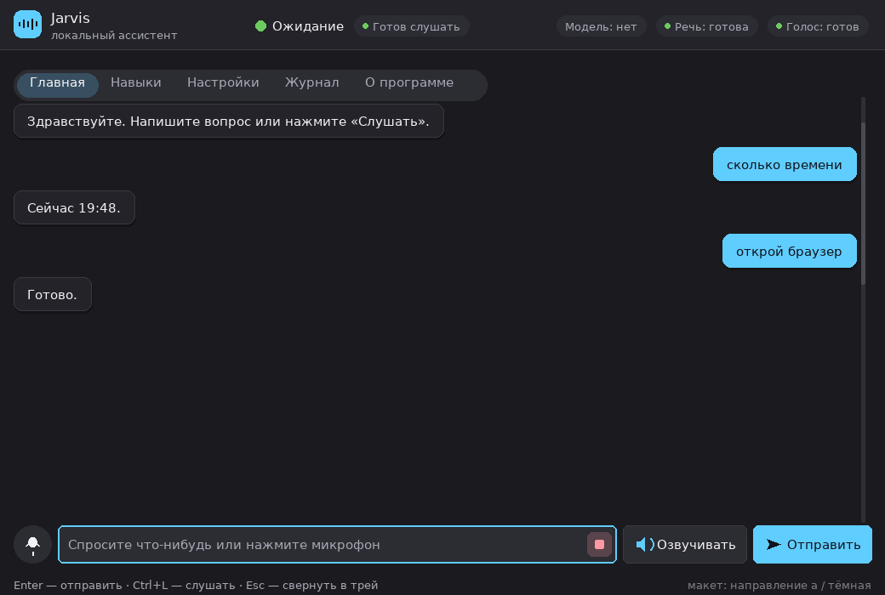
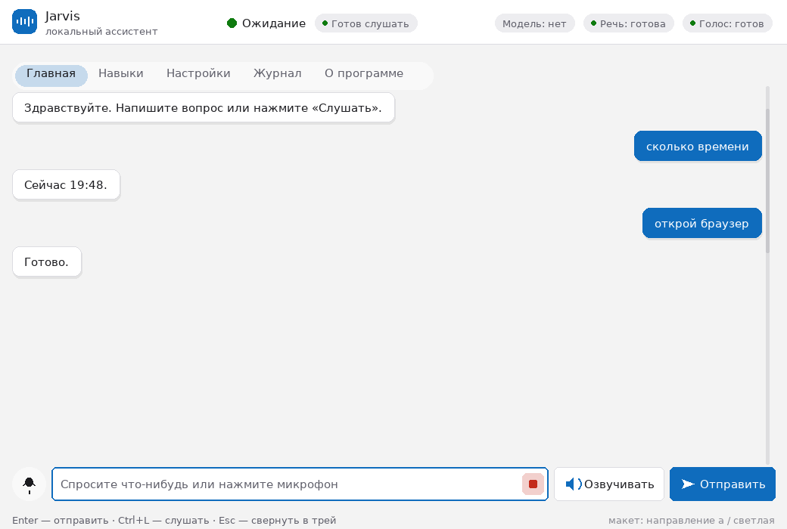
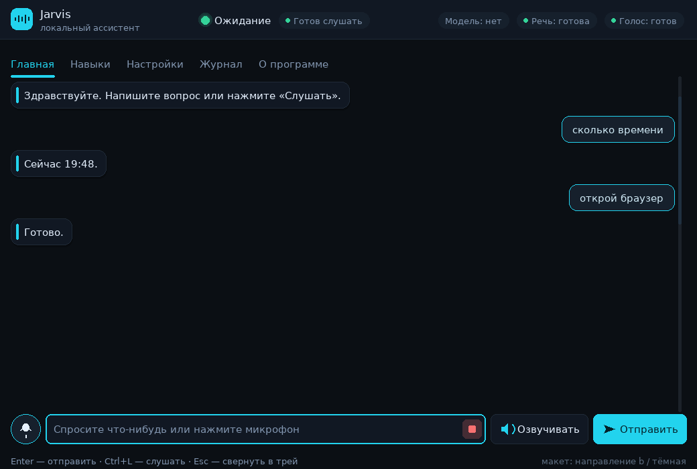
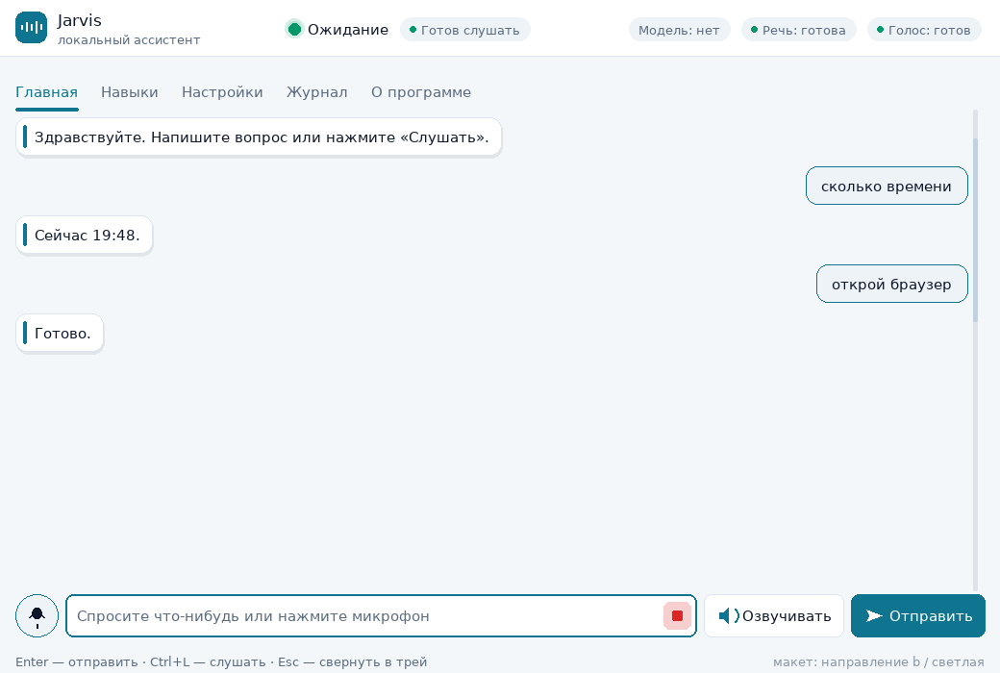
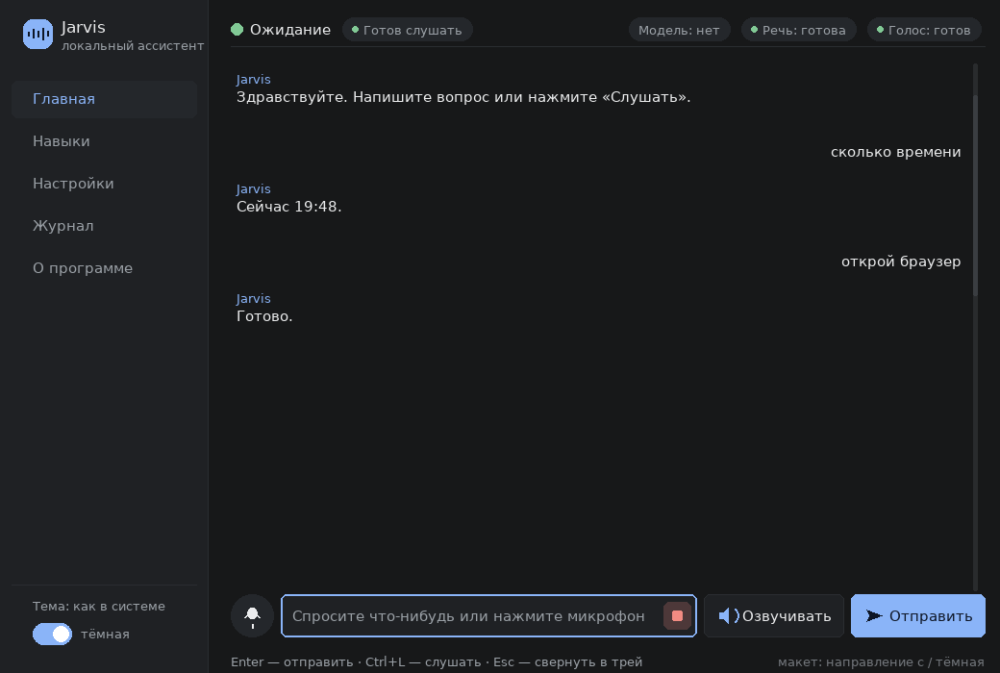
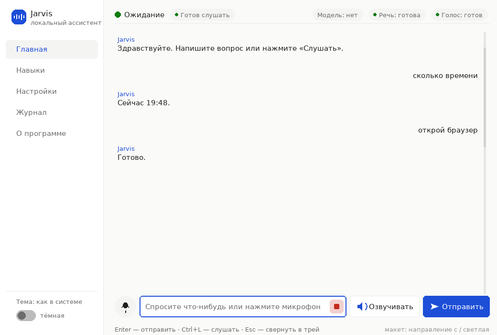

# Этап 0. Разбор внешнего вида окна Jarvis

Только разбор и предложения — код не менялся. Ниже: как выглядит сейчас, что
именно плохо, три направления нового стиля, ответ про библиотеку и вопрос, на
который нужен ваш выбор. Файлы с картинками: `docs/style/` (их рисует
`tools/style_preview.py` — из тех же токенов, что потом лягут в тему окна).

---

## 1. Как сейчас

Живое окно с вашей машины (Windows 10/11, тёмная тема):

Остальные страницы — воссоздание по коду окна и вашему скриншоту:

| Страница | Тёмная | Светлая |
| --- | --- | --- |
| Главная | `style/before-chat-dark.png` | `style/before-chat-light.png` |
| Навыки | `style/before-skills-dark.png` | `style/before-skills-light.png` |
| Настройки | `style/before-settings-dark.png` | `style/before-settings-light.png` |
| Журнал | `style/before-journal-dark.png` | `style/before-journal-light.png` |
| О программе | `style/before-about-dark.png` | `style/before-about-light.png` |

---

## 2. Что конкретно не так

### Цвета и контраст

1. **Светлые «clam»-виджеты в тёмном окне.** Кнопки, поля ввода, таблица,
   полоса прокрутки, вкладки остались системно-серыми, потому что ttk-стиль
   «clam» не перекрашивается одной строкой: у него свои рамки и градиенты.
   Отсюда «окно из 2005 года»: тёмный фон рядом со светло-серыми кнопками.
2. **Четыре разных белых прямоугольника** на экране (поле ввода — чистый
   `#ffffff`, таблица навыков — `#ffffff`, поле деталей — почти чёрное,
   журнал — чёрный). Ничего не согласовано.
3. **Тени-«объём»** у кнопок и таблицы от системной темы конфликтуют с плоскими
   текстовыми полями.
4. **Цвет фона подложки `#101418` против `#161b22`** — разница почти не видна:
   шапка, подвал и фон сливаются в одно пятно, границы окна нет.
5. **Индикатор состояния — серый кружок `#7d8590`** без подписи рядом: цвет
   ничего не сообщает, легенды нет.
6. **Цвета состояний не проверены на контраст.** Например, зелёный
   `#3fb950` в светлой теме даёт всего 2.5:1 к белому фону — точку почти не
   видно; белый текст на акценте `#2f81f7` в тёмной теме — 3.75:1, ниже порога
   4.5:1. Проверено инструментом `tools/contrast_check.py`.
7. **Уровни журнала не подсвечены** — `INFO`, `WARN`, `ERROR` одного цвета.

### Шрифты

8. **`TkDefaultFont` без явного размера** в большинстве подписей: размер
   прыгает от 8 до 11 pt, заголовки и обычный текст не отличаются по весу, нет
   отдельной подписи и моноширинного шрифта.
9. **В журнале пропорциональный шрифт** — колонки времени и источника «пляшут»,
   читать неудобно.
10. **Латинские слова («pystray», «No module named») наезжают** на русский
    текст в подвале, потому что метрики `TkDefaultFont` не рассчитаны.

### Отступы и выравнивание

11. **Нет единой шкалы.** По коду разбросаны `padx=6/8/10/12/14`, `pady=2/5/6/8/14`,
    отступы внутри `Text` — `10/8`, `12/12`. Визуально левый край не выровнен:
    шапка `14`, вкладки `10`, поля `6`, подвал `12`.
12. **Подвал сломан**: длинное сообщение «Трей недоступен: нет библиотеки
    pystray (No module named 'pystray')» налезает на подсказку «Чтобы вызвать
    ассистента, нажмите Super+J», а она уходит вправо за край окна.
13. **Строка ввода прижата к краям** (6 px), а лента чата отстоит на 6 px от
    вкладок — сбивает ритм.
14. **В настройках подписи стоят в колонку шириной `26` символов**, из-за чего
    между подписью и полем — дыра, а сами поля растянуты на 46 символов
    неаккуратно.
15. **В «Навыках» нет зазоров между таблицей, деталями и кнопками** — три
    блока стоят вплотную.

### Кнопки и поля

16. **Нет ни одного состояния**: наведение, нажатие, фокус, недоступность
    выглядят одинаково — непонятно, нажалась кнопка или нет.
17. **Главная кнопка («Отправить») не отличается** от второстепенных.
18. **Галочка «Озвучивать» съедена** (в тёмной теме системный чекбокс теряется;
    на вашем скриншоте он перекрыт надписью).
19. **Кнопка «Стоп»** в интерфейсе есть, но появляется незаметно.
20. **Поля ввода — белые прямоугольники с чёрной рамкой**, без скруглений, без
    подсветки фокуса.
21. **Ключ модели**: маска `show="•"` работает, но подпись «Ключ уже сохранён»
    отображается строкой состояния прямо в поле, из-за чего непонятно, что там
    можно печатать.

### Иконки

22. **Иконок нет вообще** — только текст («Слушать», «Отправить», «Обновить»).
    Микрофон и отправка в таком виде не считываются.
23. **Значок приложения в трее и в заголовке окна** отсутствует.

### Поведение окна

24. **При растягивании** лента чата и таблица растягиваются, а `Text` деталей
    навыка фиксирован по высоте — при большом окне пустота, при маленьком
    обрезается.
25. **Классическая полоса прокрутки** со стрелками — самый заметный признак
    «старой программы».
26. **Подсказки в подвале не переживают смену размера** — при узком окне
    наложение становится хуже.
27. **Масштаб Windows 125–150 %**: шрифты задаются в пунктах, а размеры окна —
    в пикселях (`880x640`), поэтому при 150 % окно кажется мелким, а шрифт
    крупным; DPI-awareness не выставляется.
28. **Смена темы** применяется частично: `Text`, `Canvas` и шапка перекрашены
    вручную, а ttk-виджеты — только те, что перечислены в `_apply_style`
    (например, `TCombobox` не перекрашен вовсе).

### Итого

Список не про «вкусовщину», а про три системные причины: **(а)** стиль ttk не
переопределён полностью, **(б)** нет единой шкалы цветов/шрифтов/отступов —
почти все числа написаны прямо в коде окна, **(в)** нет состояний у элементов.
Именно это и лечится Этапами 1 и 2.

---

## 3. Три направления стиля

Общее у всех трёх: **единая шкала отступов 4/8/12/16/24** и **единая шкала
шрифтов** (заголовок 21, подзаголовок 17, основной 15, подпись 13,
моноширинный 14), контраст текста не ниже 4.5:1 (проверено),
переключение светлая/тёмная/как в системе.

### Направление A — «Fluent 11» (рекомендую)

Как приложения Windows 11: мягкие скругления, плашки-карточки, один акцент,
спокойные серые. Светлая тема — основная, тёмная — привычная графитовая.

| Роль | Тёмная | Светлая |
| --- | --- | --- |
| Фон окна | `#1b1b1f` | `#f3f3f3` |
| Карточка/панель | `#232329` | `#ffffff` |
| Поле ввода | `#2c2c33` | `#ffffff` |
| Граница | `#3a3a42` | `#e1e1e4` |
| Текст | `#f3f3f7` | `#1b1b1f` |
| Подпись | `#a9a9b6` | `#5f5f6a` |
| Акцент | `#60cdff` | `#0f6cbd` |
| Текст на акценте | `#10131a` | `#ffffff` |
| Хорошо / внимание / ошибка | `#6ccb5f` / `#fce100` / `#ff99a4` | `#0f7b0f` / `#9d5d00` / `#c42b1c` |

Форма: скругления 8 (карточки), 6 (кнопки и поля), «таблетки» у подписей,
одна акцентная кнопка на экран, сообщения — плашки (моё справа на акцентной,
ответ слева на карточке). Навыки — карточки с переключателем, настройки —
три группы в карточках, журнал — карточка с цветными метками уровней.

* **Плюсы:** знакомый вид «современного приложения»; спокойные цвета не
  утомляют; светлая тема аккуратная; легко читается на 125/150 %.
* **Минусы:** самый «обычный» из трёх — ничем не выделяется; акцент
  `#60cdff` заметно светлее обычного Windows-синего.
* **Память:** без изменений — только ttk + Canvas, ни одной новой зависимости.

| Главная (светлая) | Навыки (тёмная) | Настройки (тёмная) |
| --- | --- | --- |
| `style/fluent-chat-light.png` | `style/fluent-skills-dark.png` | `style/fluent-settings-dark.png` |

### Направление B — «Тёмный футуризм»

Глубокий графит, бирюзовый акцент, тонкая светящаяся точка состояния,
моноширинные строки журнала, у сообщений ассистента — акцентная полоска слева.

| Роль | Тёмная | Светлая |
| --- | --- | --- |
| Фон окна | `#0b0f14` | `#f4f7fa` |
| Карточка/панель | `#111823` | `#ffffff` |
| Поле ввода | `#111823` | `#ffffff` |
| Граница | `#1f2a37` | `#dce5ef` |
| Текст | `#e6f1ff` | `#0f172a` |
| Подпись | `#8296b0` | `#5a6b80` |
| Акцент | `#22d3ee` | `#0e7490` |
| Текст на акценте | `#04222a` | `#ffffff` |
| Хорошо / внимание / ошибка | `#34d399` / `#fbbf24` / `#f87171` | `#059669` / `#b45309` / `#dc2626` |

Форма: скругления 12/8, активная вкладка подчёркнута линией, у состояния —
мягкое свечение (Canvas, без размытия), у сообщений пользователя — контурная
плашка. Журнал — почти чёрная консоль с цветными метками.

* **Плюсы:** самый выразительный; тёмная тема выглядит «своей» для ассистента;
  свечение аккуратно подсказывает, когда Jarvis слушает.
* **Минусы:** на слабом экране ноутбука тёмное-на-тёмном может сливаться;
  светлая версия — компромисс, она «холоднее»; свечение требует Canvas и
  аккуратной перерисовки (чуть больше кода).
* **Память:** без изменений, свечение — несколько фигур Canvas.

| Главная (светлая) | Навыки (тёмная) | Журнал (тёмная) |
| --- | --- | --- |
| `style/neon-chat-light.png` | `style/neon-skills-dark.png` | `style/neon-journal-dark.png` |

### Направление C — «Спокойный минимализм»

Боковое меню вместо вкладок, много воздуха, сообщения без плашек (только
подписи «Вы» и «Jarvis»), спокойный синий акцент.

| Роль | Тёмная | Светлая |
| --- | --- | --- |
| Фон окна | `#171819` | `#fafaf9` |
| Панель/боковое меню | `#1f2124` | `#ffffff` |
| Поле ввода | `#1f2124` | `#ffffff` |
| Граница | `#2a2d31` | `#eaeaea` |
| Текст | `#ecedee` | `#1f1f1f` |
| Подпись | `#9aa0a6` | `#6b6b6b` |
| Акцент | `#8ab4f8` | `#1d4ed8` |
| Текст на акценте | `#0e1626` | `#ffffff` |
| Хорошо / внимание / ошибка | `#81c995` / `#fdd663` / `#f28b82` | `#0f7b0f` / `#9d5d00` / `#c42b1c` |

* **Плюсы:** меньше всего визуального шума, длинный диалог читается лучше
  всего; боковое меню удобно, когда страниц станет больше.
* **Минусы:** переучиваться с вкладок на меню; сообщения без плашек — на
  больших мониторах выглядит пустовато; боковое меню забирает 216 px ширины.
* **Память:** без изменений.

| Навыки (светлая) | Журнал (тёмная) | Настройки (тёмная) |
| --- | --- | --- |
| `style/calm-skills-light.png` | `style/calm-journal-dark.png` | `style/calm-settings-dark.png` |

### Сводка

| | A. Fluent 11 | B. Футуризм | C. Минимализм |
| --- | --- | --- | --- |
| Впечатление | современное приложение Windows | тёмный «кибер»-ассистент | тихий блокнот |
| Акцент | голубой `#60cdff` | бирюзовый `#22d3ee` | синий `#8ab4f8` |
| Разметка | вкладки-«таблетки» сверху | вкладки с подчёркиванием | боковое меню |
| Сообщения | плашки | контур + полоска | без плашек |
| Светлая тема | эталонная | компромисс | нейтральная |
| Сложность кода | средняя | выше (свечение) | средняя |
| Память | 0 МБ добавки | 0 МБ добавки | 0 МБ добавки |

**Мой выбор — A.** Он ближе всего к «современному Windows», который вы просили,
одинаково хорошо держит обе темы, не требует ни одной новой библиотеки и даёт
наименьший риск при проверке на 125/150 %. Если хотите «похарактернее» — B,
и его свечение я сделаю отключаемым в настройках (уменьшать нагрузку на слабых
машинах).

**Основа может смешиваться:** например, стиль A + боковое меню из C, или A с
моноширинным журналом из B. Скажите — соберу вариант.

---

## 4. Оставаться ли на Tkinter

Короткий ответ: **да, остаёмся на Tkinter**, но стиль перестаём собирать
штатными ttk-виджетами: чат, карточки навыков, кнопки и переключатели рисуем
на Canvas своими силами (как на макетах выше). Логику не трогаем.

Почему не Qt, хотя рисовать в нём проще:

* **Размер и вес.** `PySide6` в этой песочнице — **648 МБ** установленных
  файлов и 7 системных библиотек (`libGL`, `libEGL`, `libxkbcommon`,
  `libdbus`), которых на минимальной системе может не быть; Tkinter — часть
  стандартного Python, 0 МБ. На машине с 4 ГБ RAM и на Windows, где важно
  «поставил и работает», это решающий аргумент.
* **Ваши ограничения.** «Тяжёлых зависимостей не добавлять без согласования» —
  Qt и есть такая зависимость, а exe с Qt вырастает с ~10 МБ до ~60–90 МБ и
  стартует заметно медленнее.
* **Что просили сделать заменить нельзя:** скругления, тени, состояния кнопок
  и «пузыри» чата в ttk действительно невозможны — но на Canvas они делаются
  обычными фигурами: прямоугольник с четырьмя дугами по углам. Для 32 карточек
  это около 300 фигур — для слабой машины ничто.

Что даёт Tkinter, если всё-таки нужен «готовый красивый» стиль (на случай, если
вам не понравится ручная отрисовка):

| Вариант | Размер | Плюсы | Минусы |
| --- | --- | --- | --- |
| **Своя тема на Canvas + ttk** (рекомендую) | 0 МБ | полный контроль над видом, ноль зависимостей, exe остаётся маленьким | нужно аккуратно написать ~6 своих виджетов (карточка, кнопка, переключатель, пузырь, полоса прокрутки, индикатор) |
| `ttkbootstrap` | 3.8 МБ, 205 файлов | готовые современные темы поверх ttk | чужие вкусы и рамки, свои «красивости» (пузыри, карточки) всё равно рисовать самому; тема навязывает шрифты |
| `CustomTkinter` | 1.8 МБ + Pillow 6.5 МБ | скруглённые кнопки и поля «из коробки» | тянет Pillow в рантайм приложения, вид generic-тёмный, кастомизация ограничена, скорость отрисовки на Canvas ниже |
| `PySide6` (Qt) | 648 МБ + системные библиотеки | лучший внешний вид, готовые анимации, скругления | вес, лицензия LGPL (для exe нужны оговорки), тормозит старт, ломает «без тяжёлых зависимостей» |

Тема (цвета/шрифты/радиусы/отступы) в любом случае уезжает в один файл
`jarvis/interfaces/theme.py`, а окно перестаёт содержать цвета в коде — это
Этап 1, от выбора библиотеки не зависит.

---

## 5. Что предлагаю сделать дальше (Этапы 1–2)

**Этап 1 — система стиля.** Файл `jarvis/interfaces/theme.py`: палитры тёмная,
светлая и «как в системе», шкала отступов, размеры и семейства шрифта, радиусы,
цвета состояний, стили ttk. Ни одного цвета в коде окна. Проверка контраста —
`tools/contrast_check.py` (и тест, чтобы правкой нельзя было испортить палитру).
Подбор шрифтов: интерфейс — Segoe UI Variable/Segoe UI (системные в Windows),
Noto Sans/DejaVu Sans (Linux, OFL), моноширинный — Cascadia Mono/Consolas
(системные), DejaVu Sans Mono (Linux); всё с разрешающей лицензией, список — в
`docs/DEVELOPERS.md`.

**Этап 2 — экраны.** Главное окно (пузыри, поле ввода с кнопками, индикатор с
мягкой анимацией), навыки карточками, настройки группами, журнал с цветными
уровнями, значки, состояния у всех элементов, поведение при растягивании и на
125/150 %.

**Проверка после каждого шага:** макеты до/после в обеих темах, `pytest -q`
(сейчас 226 тестов), `tools/measure_memory.py` до и после (память окна можно
измерить только там, где есть Tkinter — на вашей машине; в песочнице нет ни
Tkinter, ни графики, поэтому картинки — макеты, нарисованные кодом).

**Про exe — да, можно, и это логично.** План: после Этапа 2 добавляю
`tools/build_exe.py` + инструкцию (PyInstaller, сборка **onedir**: папка
~40 МБ, старт быстрее; при желании onefile — один файл ~35–45 МБ, старт
медленнее). Нужно будет зашить в сборку tcl/tk, иконку и `legacy/models` не
тянуть. Сборка делается на Windows-машине (из Linux exe не собрать) —
подготовлю скрипт и проверю, что окно работает с ресурсами из сборки.
Скажете — включу сборку в Этап 3.

---

## 6. Замеры для отчёта (до изменений)

Сделано инструментом `tools/measure_memory.py` (без внешних зависимостей,
работает и на Windows; каждый сценарий — отдельный процесс, цифры — лучший из
двух прогонов):

| Сценарий | Сейчас | Пик |
| --- | --- | --- |
| пустой Python (точка отсчёта) | 7.7 МБ | 7.7 МБ |
| `jarvis ask "сколько времени"` | 17.1 МБ | 17.1 МБ |
| ядро-демон без голоса | 16.2 МБ | 16.2 МБ |
| ядро + локальный API | 23.6 МБ | 23.6 МБ |
| импорт модуля окна (без Tkinter) | 16.7 МБ | 16.7 МБ |
| окно открыто и работает | — | — | (в песочнице нет Tkinter) |

Эти же замеры повторю после Этапов 1–2 и сравню.

---

## 7. Вопрос, на который нужен ответ

1. **Направление:** A «Fluent 11» (рекомендую), B «Тёмный футуризм»,
   C «Спокойный минимализм» или своя смесь?
2. **Акцент:** оставить предложенный или задать свой цвет?
3. **Библиотека:** остаёмся на Tkinter со своей отрисовкой на Canvas
   (рекомендую, 0 МБ и exe маленький) — или подключаем лёгкую надстройку
   (`ttkbootstrap` 3.8 МБ / `CustomTkinter` + Pillow) или Qt (тяжело)?
4. **exe:** добавлять сборку в Этап 3?

Дальше не двигаюсь — жду выбора.
