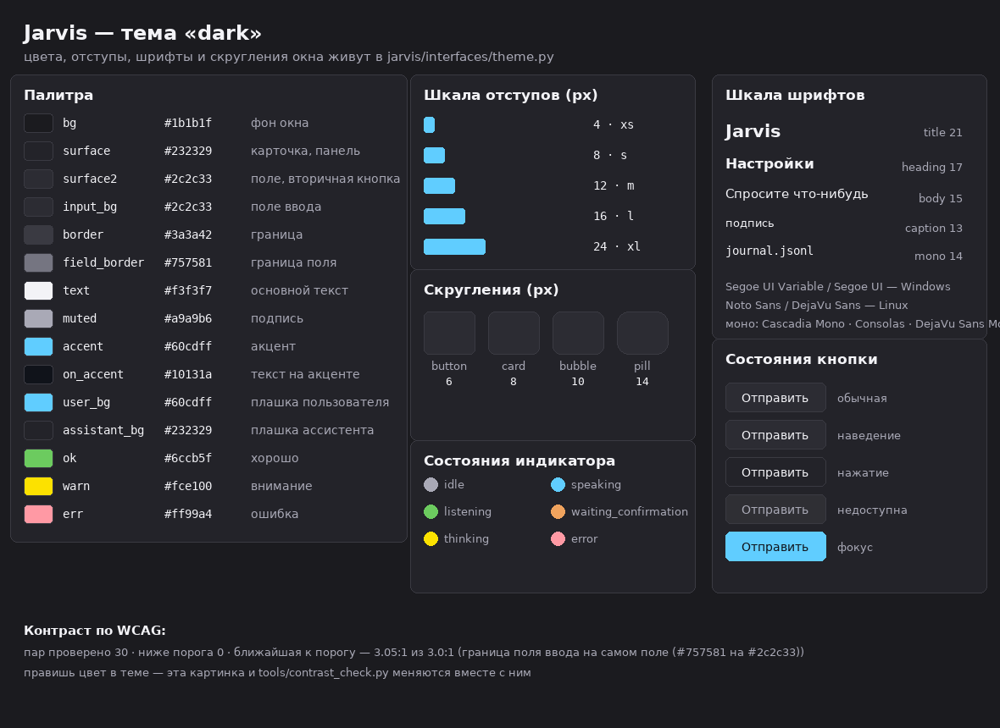
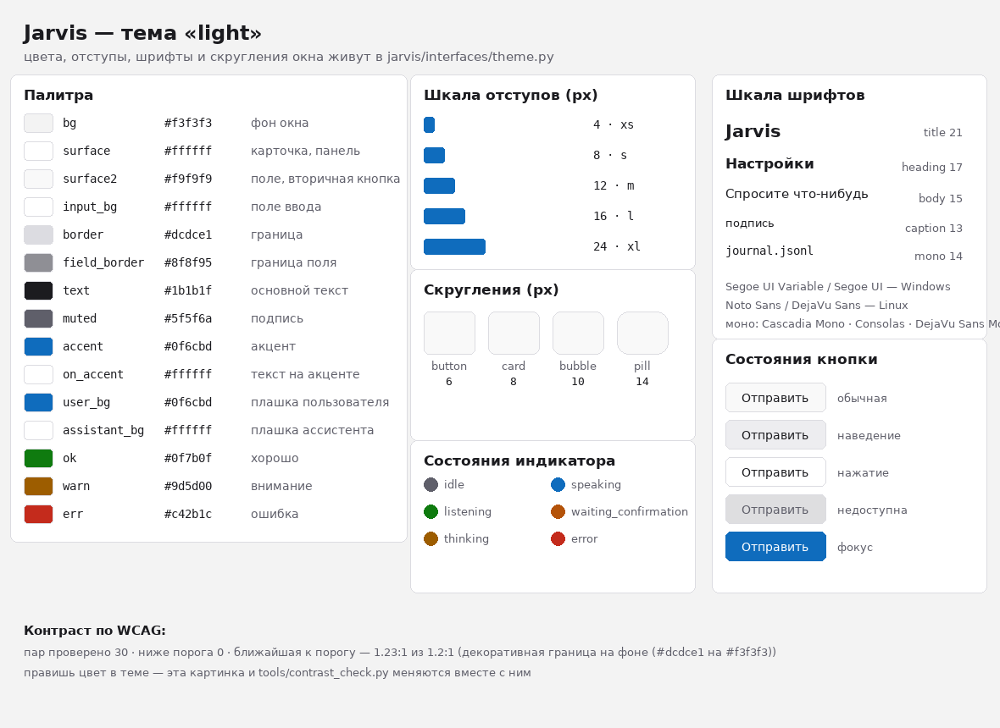

# Этап 1. Система стиля

Направление — **A «Fluent 11»** (выбран вами), акцент `#60cdff` в тёмной теме и
`#0f6cbd` в светлой. Остальные вопросы взяты по моим рекомендациям из Этапа 0:
остаёмся на Tkinter со своей отрисовкой, сборку exe делаем после экранов.

Код окна логику не менял: правки только в слое интерфейса.

---

## Что сделано

### 1. Стиль — в одном файле

`jarvis/interfaces/theme.py` — единственное место с цветами, отступами,
шрифтами, скруглениями и настройкой ttk. В `gui.py` **не осталось ни одного
цвета и ни одного отступа числом**, и это проверяется тестом
(`tests/test_theme.py::OneSourceOfTruthTests`): если кто-то снова напишет
`#2f81f7` или `padx=6` прямо в окне, тест упадёт.

| Что | Значение |
| --- | --- |
| Отступы | 4 / 8 / 12 / 16 / 24 (`xs`, `s`, `m`, `l`, `xl`) |
| Скругления | кнопка 6, поле 6, карточка 8, «пузырь» 10, «таблетка» — по высоте |
| Шрифты | заголовок 21, подзаголовок 17, основной 15, подпись 13, моноширинный 14 |
| Семейства | Windows: Segoe UI Variable → Segoe UI; Linux: Noto Sans → DejaVu Sans; моно: Cascadia Mono → Consolas → DejaVu Sans Mono |
| Роли цвета | 19 ролей: фон, панель, поле, границы (декоративная и поля ввода), текст, подпись, акцент, текст на акценте, плашки пользователя и ассистента, «таблетки», хорошо/внимание/ошибка |

### 2. Светлая, тёмная и «как в системе»

Настройка `assistant.theme` теперь принимает три значения, по умолчанию —
`system`:

* Windows — реестр (`AppsUseLightTheme`);
* macOS — `defaults read -g AppleInterfaceStyle`;
* Linux — `gsettings` (GNOME) и `GTK_THEME`;
* если узнать не удалось — тёмная (тема Jarvis по умолчанию).

В настройках окна список стал человеческим: «как в системе / тёмная / светлая».
Смена темы применяется **на лету**: перекрашиваются и ttk-стили, и обычные
виджеты (они записаны в `self._themed`), и метки чата. Переменная
`JARVIS_THEME=light` перекрывает определение — удобно для проверок.

### 3. Контраст

Проверка `tools/contrast_check.py` (и тест) считает 30 пар на каждую тему:

| Порог | Что проверяется | Результат |
| --- | --- | --- |
| 4.5:1 | текст на любом своём фоне, плашки, «таблетки», акцент как текст | ни одной пары ниже |
| 3:1 | состояния (слушаю, думаю, отвечаю, ошибка…) на фоне и на панели, фокус, границы полей ввода | ни одной пары ниже |
| 1.2:1 | декоративные границы карточек — только различимость | проходит |

Для сравнения: у прежней палитры было несколько провалов — белый текст на
акценте `#2f81f7` давал 3.75:1, а зелёная точка «слушаю» в светлой теме
2.5:1.

### 4. Масштаб 125 % и 150 % в Windows

Перед созданием окна вызывается `enable_dpi_awareness()` (без него система
растягивает картинку, и текст становится мыльным), а `tk_scaling(root)`
подгоняет масштаб Tk под фактический DPI. На Linux и macOS это не требуется.

### 5. Состояния у элементов

ttk-стили теперь описывают наведение, нажатие, недоступность, фокус и выбор —
для кнопок, вкладок, полей, списков и выпадающих списков. Появились
`Accent.TButton` (главная кнопка — «Отправить», «Сохранить настройки»),
`Card.TFrame`, `Heading.TLabel`.

---

## Как это выглядит

Лист токенов темы — рисуется **из самого файла темы**, поэтому не может
разойтись с кодом (`python tools/style_preview.py --style tokens --theme both`):




Макеты экранов направления A (`docs/style/fluent-*.png`) теперь тоже берут
палитру и шкалы из темы — то есть показывают ровно то, что будет в окне.

**Важно:** на этом этапе изменились цвета, шкалы, шрифты и состояния, но сами
экраны ещё собраны из стандартных ttk-виджетов. Пузыри чата, карточки навыков,
скруглённые поля, иконки, анимация индикатора и трей — это Этап 2, сразу после
вашего подтверждения. На вашей машине уже сейчас видно новую палитру:
`python -m jarvis gui` (нужен Tkinter).

---

## Память и тесты (до → после)

| Что | Этап 0 | Этап 1 |
| --- | --- | --- |
| пустой Python (отсчёт) | 7.7 МБ | 7.7 МБ |
| `jarvis ask "сколько времени"` | 17.1 МБ | 17.0 МБ |
| демон без голоса | 16.2 МБ | 16.2 МБ |
| ядро + локальный API | 23.6 МБ | 24.2 МБ |
| импорт модуля окна (без Tkinter) | 16.7 МБ | 16.7 МБ |
| тестов | 226 | **250** |

Замеры — `tools/measure_memory.py`, по два прогона на сценарий, лучший
результат. Новых зависимостей не появилось ни одной: тема — чистый Python,
Tkinter уже входит в стандартный Python. Открытое окно измерить в песочнице
нельзя (здесь нет Tkinter) — эту цифру покажет ваша машина.

---

## Изменённые файлы

| Файл | Что изменилось |
| --- | --- |
| `jarvis/interfaces/theme.py` | **новый** — весь стиль: палитры, шкалы, шрифты, состояния, контраст, тема системы, DPI |
| `jarvis/interfaces/gui.py` | убраны цвета, шрифты и отступы; палитра и шрифты берутся из темы; смена темы на лету; DPI |
| `jarvis/config/config.default.toml` | `theme = "system"` и пояснение про три значения |
| `jarvis/config/i18n/ru.json` | «как в системе / тёмная / светлая», пояснение к теме (177 ключей) |
| `tests/test_theme.py` | **новый** — 24 теста: палитры, контраст, шкалы, шрифты, состояния ttk, системная тема, DPI, «одно место правды» |
| `tools/contrast_check.py` | берёт палитру и функцию контраста из темы (своей копии больше нет) |
| `tools/style_preview.py` | палитра и шкалы направления A — из темы; новый режим `--style tokens` (лист токенов) |
| `docs/DEVELOPERS.md` | **новый** — как устроена тема, как менять цвета и шрифты, лицензии шрифтов |
| `docs/style/tokens-*.png` | **новые** картинки: палитра, шкалы, состояния кнопок |

---

## Что осознанно не сделано (пока)

1. **Пузыри сообщений, карточки навыков, скруглённые поля, свои кнопки и
   скроллбар** — это Этап 2 (экраны). Сейчас элементы ещё стандартные ttk.
2. **Иконки** (микрофон, отправка, трей) — Этап 2: рисуются на Canvas, чтобы не
   тянуть наборы иконок и их лицензии.
3. **Мягкая анимация индикатора состояния** — Этап 2.
4. **Проверка на живом экране** — в песочнице нет ни Tkinter, ни графики,
   поэтому фактические шрифты, скругления и масштаб 125/150 % проверите вы;
   для этого и сделаны тесты на шкалы, контраст и отсутствие цветов в коде.
5. **Скриншоты «было/стало» из настоящего окна** — до Этапа 2 их не сделать по
   той же причине; вместо них на этом шаге лист токенов и макеты.
6. **Сборка exe** — после экранов, как договорились.

---

## Что стоит посмотреть у себя

```bash
python -m jarvis gui                      # новая палитра, тема «как в системе»
JARVIS_THEME=light python -m jarvis gui   # принудительно светлая
python tools/contrast_check.py            # таблица контраста
python -m pytest -q                       # 250 тестов
```

Дальше — Этап 2: экраны. Жду подтверждения.
